# MiniCAD

## 功能演示

### 界面介绍

使用`java -jar MiniCAD.jar`命令打开MiniCAD，打开后的窗口如下图所示：

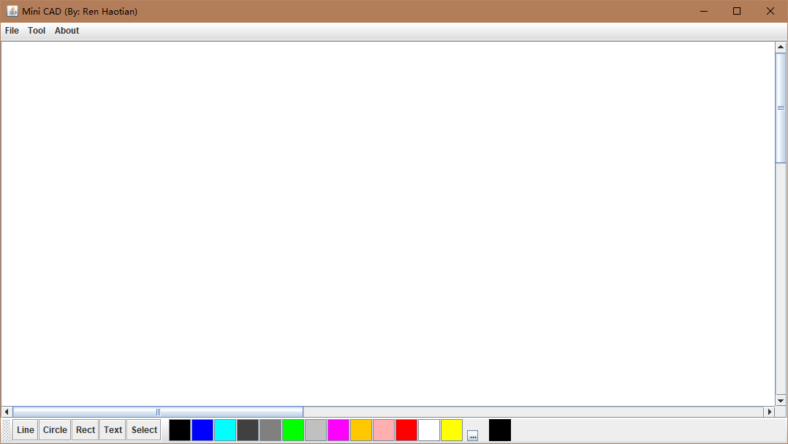

可以将MiniCAD程序界面分为以下三个部分：

1. 菜单栏

   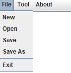

   菜单栏用于进行文件操作与CAD工具选择操作，在About下可以查看帮助信息以及关于信息。

2. 工具栏

   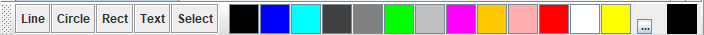

   工具栏用于进行CAD工具的选择以及画图颜色的选取。

3. 画板区

   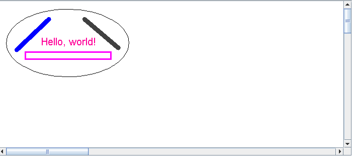

   在画板区可以通过使用CAD工具进行CAD图形的绘制。

### 使用说明

#### 图形绘制

开启程序后默认工具为选择工具（Select），此时若要进行图形绘制，需要先使用在菜单栏或工具栏，在其中单击选择相应的绘图工具，在画板区域进行鼠标拖拽即可绘制新图形。

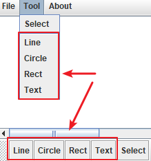 -> 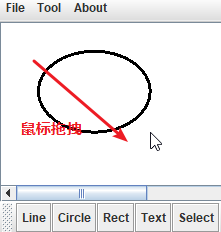

不过一个例外是CAD文字（Text）的绘制方式，当使用Text工具时，在画板上进行单击，会弹出以下弹窗：

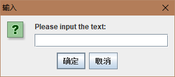

在此进行输入，点击确认后可以在画板上绘制出默认大小的文字：

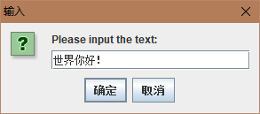 -> 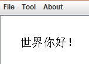

#### 图形选取

图形的选取是为了对某一个图形进行颜色、大小、线条粗细以及位置的改变。

在MiniCAD中，图形有两种选取方式：

1. 自动选取

   当绘制完一个图形后，便会自动选取所绘制图形，但由于此时鼠标拖拽会进行新图形的绘制，故在自动选取的情况下无法进行图形位置的改变。

2. 手动选取

   使用鼠标单击菜单栏或工具栏中的Select将当前工具更换为选择工具。随后在所绘制图形的有色部分进行单击，即选取了该CAD图形。

   要进行进行位置的变更，则需要在图形有色部分上进行单击拖拽，如下所示：

   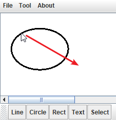 -> 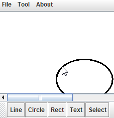

#### 图形更改

对于CAD图形，拥有以下4种变化方式：

1. 更改大小
2. 更改线条粗细
3. 更改位置
4. 更改颜色

在菜单栏About项中有Help部分可以查看，对前两种变化方式进行了说明：

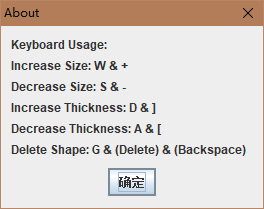

更改位置的具体操作已在前文图形选取部分进行了说明，此处不再赘述，以下对于更改颜色的方法进行相关说明，颜色的更改使用在下方工具栏的色彩区进行设置：


其中左侧的13种颜色为常用颜色框，对齐进行单击即可以选择其颜色，使用按钮隔开的右侧颜色表示当前所使用的颜色，中间的按钮表示对更多颜色的选取，在任意时刻更换颜色会导致当前所选择CAD的图形颜色发生变更，也会导致之后所有绘制的图形颜色发生变更。

以下图为例：

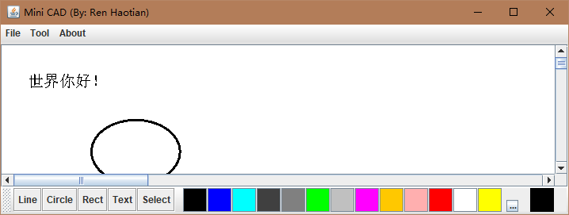

当前所选取的图形为文字“世界你好”，现在单击红色，会变为如下情形：

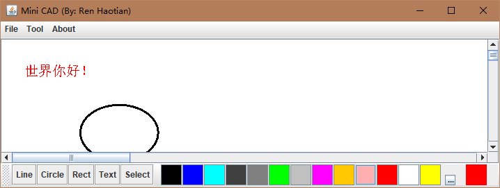

可以看到文字的颜色发生了变化，右下角的当前颜色指示窗也发生了变化。

单击色彩区中间的按钮，可以看到更多颜色的选择框：

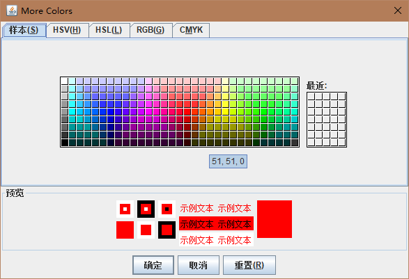

#### 文件操作

通过菜单栏File选项进行可以进行文件的新建、打开、保存以及另存为，其界面使用Java所提供的对话框实现，如下图所示，使用方式不进行描述。

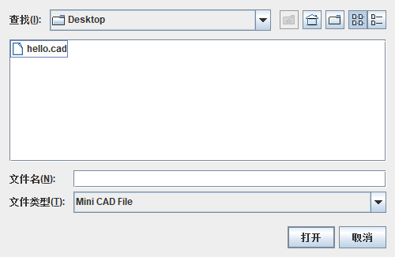

要注意的一点是，当画板上存在未保存的操作时进行新建、打开、退出操作时，则会弹出如下提示进行确认：

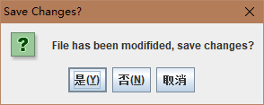

## 实现方式

### 整体架构

MiniCAD代码的组织形式如下：

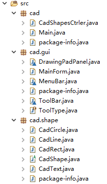

其中cad包用于进行main函数入口的定义以及对画板中CAD形状的管理，同时提供与文件相关的操作，cad.gui包用于进行MiniCAD用户界面的绘制以及用户事件的监听，cad.shape包定义了MiniCAD中的CAD形状。

### 模块实现

以下我们按照从后往前的顺序对于3个包内的实现进行说明。

#### cad.shape包

##### 抽象公共父类

在cad.shape包内定义了CAD形状，包括椭圆CadCircle类、线段CadLine类、矩形CadRect类、文字CadText类，而这4个类均继承于抽象父类CadShape，除去其中内部类以及set、get类方法等，抽象类CadShape的部分重要代码如下：

```java
public abstract class CadShape {
	final protected double increaseCoef = 1.05;
	final protected double decreaseCoef = 0.95;
	final protected int maxStroke = 20;
	private ShapeType shapeType = ShapeType.UNDEFINED;
	private Color color = Color.BLACK;
	private int thickness = 3;
	private HashSet<Coord> coordsSet = new HashSet<Coord>();
	public boolean containsCoord(int x, int y) {
		return coordsSet.contains(new Coord(x, y));
	}
	public void draw(Graphics2D g2d) {
		g2d.setColor(color);
		g2d.setStroke(new BasicStroke(thickness, BasicStroke.CAP_ROUND, BasicStroke.JOIN_MITER));
		drawCadShape(g2d);
		coordsSet.clear();
		genCoordsSet();
	}
	abstract protected void drawCadShape(Graphics2D g2d);
	abstract protected void genCoordsSet();
	// When generateCoord, need to add coordinates to CoordSet:
	protected void addCoord(int x, int y) {
		coordsSet.add(new Coord(x, y));
	}
	// Move shape from (currentX, currentY) to (currentX + deltaX, currentY + deltaY):
	abstract public void move(int deltaX, int deltaY);
	// Used for changing the size of the shape:
	abstract public boolean increaseSize();
	abstract public boolean decreaseSize();
	// Used for creating shape by dragging:
	abstract public void setShapeWithPos(int x1, int y1, int x2, int y2);
}
```

CadShape的绘制依赖于其draw方法，为保证draw方法的调用，需要我们实现两个抽象方法：

```java
abstract protected void drawCadShape(Graphics2D g2d);
abstract protected void genCoordsSet();
```

drawCadShape函数用于实现CadShape在g2d上的绘画，genCoordsSet则用来生成落在CadShape上所有点的坐标到coordsSet中，其中，coordsSet用来保存CAD形状有色部分所有点的集合，用来进行点击事件发生时的判断，会在后文gui部分予以说明。

其它的抽象方法的用途较为简单，可以在方法名及代码注释中获得。

由此，我们要实现一个形状，只需要实现以上6个函数即可。

##### 描绘形状

对于椭圆、线段、矩形、文字四种类型，Graphics2D均提供了绘制的方法，我们只需要进行间的的调用即可。

对于椭圆类CadCircle：

```java
@Override
public void drawCadShape(Graphics2D g) {
	g.drawOval(posX, posY, width, height);
}
```

对于线段类CadLine：

```java
@Override
protected void drawCadShape(Graphics2D g2d) {
	g2d.drawLine(x1, y1, x2, y2);
}
```

对于矩形类CadRect：

```java
@Override
protected void drawCadShape(Graphics2D g2d) {
	g2d.drawRect(posX, posY, width, height);
}
```

对于文字类CadText的实现则较为复杂，因为我们需要计算点集，故需要所写文字所占空间的长和宽，在绘画时需要对其进行计算，我使用一个Rectangle2D类实现：

```java
@Override
protected void drawCadShape(Graphics2D g2d) {
	Font font = new Font(null, Font.PLAIN, size);
	g2d.setFont(font);
	// Get width and height:
	FontRenderContext context = g2d.getFontRenderContext();
	Rectangle2D stringBounds = font.getStringBounds(text, context);
	height = stringBounds.getHeight() / 2;
	width = stringBounds.getWidth();
	g2d.drawString(text, posX, posY + (int) height);
}
```

##### 计算点集

MiniCAD实现的一个难点即是计算点集，在这里我们需要使用到高中的解析几何知识，由于无法坐标的整数性，我们无法精确地获得每一点的坐标，因此采用了一定的方法进行了拟合。

由于矩形的处理方法较简单，而文字由于无法精确到文字上的点采用了类似矩形的处理方法，在此我们仅讨论椭圆与线段的处理。

对于椭圆而言，我利用极坐标与直角坐标转换的方式进行计算，采用多个正方形区域对椭圆进行拟合，如下：

```java
protected void genCoordsSet() {
	int stroke = getThickness();
	stroke = stroke > 5 ? stroke / 2 : 2;
	stroke = stroke < maxStroke ? stroke : maxStroke;
	double a = (double) width / 2; // Minor axis length on horizontal direction.
	double b = (double) height / 2; // Minor axis length on vertical direction.
	double centerX = posX + a;
	double centerY = posY + b;
	double angleStep = 120 * stroke / Math.max(a, b);
	for (double angle = 0; angle < 360; angle += angleStep) {
		// coordDeltaX & coordDeltaY mean the distance from center.
		for (int coordDeltaX = -stroke; coordDeltaX <= stroke; ++coordDeltaX) {
			for (int coordDeltaY = -stroke; coordDeltaY <= stroke; ++coordDeltaY) {
				int x = (int) (centerX + coordDeltaX + a * Math.cos((double) angle / 360 * Math.PI * 2));
				int y = (int) (centerY + coordDeltaY + b * Math.sin((double) angle / 360 * Math.PI * 2));
				addCoord(x, y); // add current calculated coordinate into coordinates set.
			}
		}
	}
}
```

其中angleStep用来确定每一次偏转角度的大小，这样当图形较大时，可以保证将角度划分得较多，从而不会存在漏覆盖得情况，在CadShape.java的100-111行有被注释掉的调试代码，可以用来检测点集的覆盖情况。

下图表示在不同粗细、不同大小情况下的覆盖情况，其中兰色表示点集，黑色表示原图形：


其覆盖情况是可以接受的。

对于线段而言，除去斜率为0和斜率不存在的两个特殊情况，使用斜率进行处理：

```java
protected void genCoordsSet() {
	int stroke = getThickness();
	stroke = stroke > 5 ? stroke / 2 : 2;
	stroke = stroke < maxStroke ? stroke : maxStroke;
	if (特殊情况) {
        ...
	} else {
		double k = (double) (y2 - y1) / (x2 - x1); // k is slope.
		// Guarantee coverage in two condition:
		if (-1 < k && k <= 1) {
			int xMin, xMax, yBegin;
			if (x1 < x2) {
				xMin = x1 - stroke;
				xMax = x2 + stroke;
				yBegin = (int) (y1 - stroke * k);
			} else {
				xMin = x2 - stroke;
				xMax = x1 + stroke;
				yBegin = (int) (y2 - stroke * k);
			}
			for (int x = xMin; x <= xMax; ++x) {
				double yCenter = yBegin + (x - xMin) * k;
				for (int y = (int) yCenter - stroke; y <= (int) Math.
					addCoord(x, y);
				}
			}
		} else {
			int yMin, yMax, xBegin;
			if (y1 < y2) {
				yMin = y1 - stroke;
				yMax = y2 + stroke;
				xBegin = (int) (x1 - stroke / k);
			} else {
				yMin = y2 - stroke;
				yMax = y1 + stroke;
				xBegin = (int) (x2 - stroke / k);
			}
			for (int y = yMin; y <= yMax; ++y) {
				double xCenter = xBegin + (y - yMin) / k;
				for (int x = (int) xCenter - stroke; x <= (int) Math.
					addCoord(x, y);
				}
			}
		}
	}
}
```

可以看出，以直线 `y = |x|` 分成了两种情况进行处理，具体覆盖情况如下：

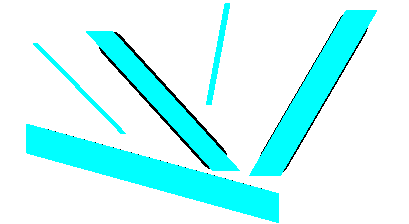

覆盖率良好，可以接受。

#### cad.gui包

在该包中定义了gui的组成以及事件的监听。

##### 界面构成

界面由以下4个文件构成：

```
DrawingPadPanel.java
MainForm.java
MenuBar.java
ToolBar.java
```


以上为程序打开时的界面，由MainForm类继承JFrame得到，其内部包含各个其它组件，我们可以对其做如下分类：

MenuBar类：


ToolBar类：


ToolBar类内部类ColorsPanel：


##### 事件监听

在此，我们对于核心事件进行说明，包括鼠标在画板上的点击、拖拽，用于进行图形变换的热键，于这两部分相关的事件均为画板相关事件，故定义在DrawingPadPanel类中。

事实上，DrawingPadPanel类定义了MiniCAD的画板，实际上在MiniCAD的实现中，画板的上方存在一层画布，即在DrawingPadPanel类中存在一个内部擦canvasPanel，所监听的事件正是在这层canvasPanel画布上进行操作。

- 键盘事件

  键盘热键的检测较为简单，我们只需在检测到相应的按键时调用CadShape的相关方法即可，依靠公共抽象父类，这一操作十分便捷。

  ```java
  canvasPanel.addKeyListener(new KeyAdapter() {
  	@Override
  	public void keyPressed(KeyEvent e) {
  		if (curShape == null) {
  			return;
  		}
  		boolean shapeHasChanged;
  		switch (e.getKeyCode()) {
  		case KeyEvent.VK_MINUS:
  		case KeyEvent.VK_S:
  			shapeHasChanged = curShape.decreaseSize();
  			break;
  		case KeyEvent.VK_EQUALS:
  		case KeyEvent.VK_W:
  			shapeHasChanged = curShape.increaseSize();
  			break;
  		case KeyEvent.VK_OPEN_BRACKET:
  		case KeyEvent.VK_A:
  			shapeHasChanged = curShape.decreaseThickness();
  			break;
  		case KeyEvent.VK_CLOSE_BRACKET:
  		case KeyEvent.VK_D:
  			shapeHasChanged = curShape.increaseThickness();
  			break;
  		case KeyEvent.VK_BACK_SPACE:
  		case KeyEvent.VK_DELETE:
  		case KeyEvent.VK_G:
  			removeCadShape(curShape);
  			curShape = null;
  			shapeHasChanged = true;
  			break;
  		default:
  			return;
  		}
  		if (shapeHasChanged) {
  			repaint();
  			isChangesSaved = false;
  		}
  	}
  });
  ```

- 鼠标事件

  需要监听的鼠标事件包括两种：鼠标单击以及鼠标拖拽。

  - 鼠标单击

    鼠标单击的实现需要了我们监听鼠标按键以及鼠标按键释放两种事件。

    当当前CAD工具为选择工具时，单击表示选中当前CAD形状，而CAD形状的选取方法则依靠对当前鼠标所按键位置是否在点集中进行判断，最后我们需要做的仅仅是根据画布是否发生了变化决定是否进行repaint。

    ```java
    canvasPanel.addMouseListener(new MouseAdapter() {
    	@Override
    	public void mousePressed(MouseEvent e) {
    		if (e.getButton() != MouseEvent.BUTTON1) { // Not left mouse button.
    			return;
    		}
    		isLeftButtonPressed = true;
    		ToolType toolType = getToolType();
    		if (toolType == ToolType.SELECT) {
    			curShape = getCadShapeByCoord(e.getX(), e.getY());
    			if (curShape == null) {
    				return;
    			}
    			pressedX = currentX = e.getX();
    			pressedY = currentY = e.getY();
    		} else {
    			pressedX = currentX = e.getX();
    			pressedY = currentY = e.getY();
    			switch (toolType) {
    			case CIRCLE:
    				curShape = new CadCircle(pressedX, pressedY, curColor);
    				break;
    			case LINE:
    				curShape = new CadLine(pressedX, pressedY, curColor);
    				break;
    			case RECT:
    				curShape = new CadRect(pressedX, pressedY, curColor);
    				break;
    			case TEXT:
    				String text = JOptionPane.showInputDialog("Please input the text:");
    				if (text != null && !text.isEmpty()) {
    					curShape = new CadText(text, pressedX, pressedY, curColor);
    					break;
    				} 
    				return;
    			default:
    				return;
    			}
    			addCadShape(curShape);
    			repaint();
    			isChangesSaved = false;
    		}
    	}
    	@Override
    	public void mouseReleased(MouseEvent e) {
    		if (e.getButton() == MouseEvent.BUTTON1) {
    			isLeftButtonPressed = false;
    		}
    	}
    });
    ```

  - 鼠标拖拽

    对于鼠标拖拽，我们仍需分两种情况进行相应处理，若工具类型为Select，且在第一次鼠标press事件中获取到了CadShape对象则进行CAD形状的移动操作，若工具为其他类型，则说明在使用鼠标拖拽新建CAD图形，使用已完成的setShapeWithPos设置新位置即可，最后同样注意进行repaint。

    ```java
    @Override
    public void mouseDragged(MouseEvent e) {
    	if (!isLeftButtonPressed) {
    		return;
    	}
    	ToolType toolType = getToolType();
    	if (toolType == ToolType.SELECT) {
    		if (curShape == null) {
    			return;
    		}
    		currentX = e.getX();
    		currentY = e.getY();
    		curShape.move(currentX - pressedX, currentY - pressedY);
    		pressedX = currentX;
    		pressedY = currentY;
    	} else {
    		switch (toolType) {
    		case CIRCLE:
    		case LINE:
    		case RECT:
    			currentX = e.getX();
    			currentY = e.getY();
    			curShape.setShapeWithPos(pressedX, pressedY, currentX, currentY);
    			break;
    		default:
    			return;
    		}
    	}
    	repaint();
    	isChangesSaved = false;
    }
    ```

#### cad包

在cad包中定义了main函数以及对所有CadShape集合的管理类，在此我们对其中的CadShape集合的文件操作进行说明。

##### 二进制文件结构

文件的格式如下图所示：

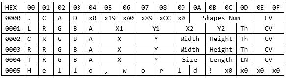

MiniCAD二进制文件要求16字节对齐，以16字节作为一个行进行读写。

文件开头前16个字节，即第一行作为文件头，存放文件类型校验信息以及CAD形状的数量，使用".CAD"作为字符串，之后接一个0x0，随后是将我的学号3150104714以8进制解释的数值，再紧接一个0x0后为int型数值表示CAD形状的数量，最后两位为校验码。

对于其它行而言，根据第一个字节来判断所存储形状的类型，将其识别为字符类型，L、C、R、T分别表示线段、椭圆、矩形以及文字。随后4个字节以RGBA形式储存颜色，接下来的8个字节储存位置以及大小信息，随后为1个字节，用于存储线条粗细程度（即表格中Th），最后两位为校验码。

但是对于文字类型有所差别，对照以上别个进行说明，Size处存放文字的大小，Length表示文字内容的二进制字节码的长度，由于文件读写以行为单位，LN表示the Number of Lines，即所占的行数，同样CV表示校验值，在Text行之后会紧接着LN行来存储文字内容，若以表格中的为例，那么Length=12，LN=1，对于文字内容部分同样需要保证16字节对齐，不足一行的则使用0x0补齐。

校验码的计算方法如下：

```java
private byte[] getCheckValueBytes(byte[] lineBytes) {
	byte[] bytes = new byte[2];
	bytes[0] = (byte) (lineBytes[0] ^ lineBytes[2] ^ lineBytes[4] ^ lineBytes[6] ^ lineBytes[8] ^ lineBytes[10] ^ lineBytes[12]);
	bytes[1] = (byte) (lineBytes[1] ^ lineBytes[3] ^ lineBytes[5] ^ lineBytes[7] ^ lineBytes[9] ^ lineBytes[11] ^ lineBytes[13]);
	return bytes;
}
```

通过校验码与Java文件操作异常处理相结合，我们可以保证文件读取的正确性。

##### main函数入口

main函数通过invoke的方式对MainForm构造，如下：

```java
import javax.swing.SwingUtilities;

import cad.gui.MainForm;

public class Main {

	public static void main(String[] args) {
		SwingUtilities.invokeLater(new Runnable() {
			public void run(){
				new MainForm();
			}
		});
	}

}
```

